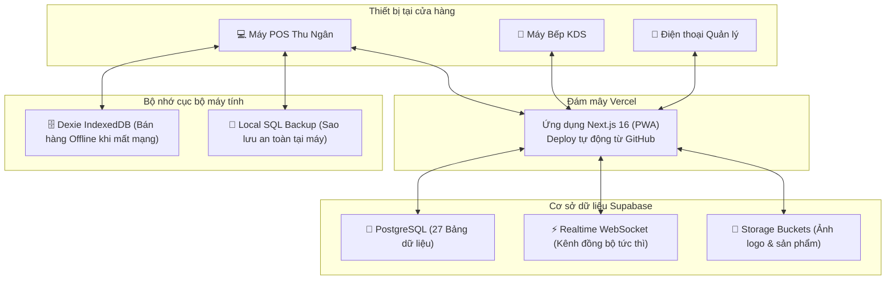

# 📘 HƯỚNG DẪN TỔNG HỢP: KHỞI TẠO DATABASE SQL & TRIỂN KHAI VERCEL
## Hệ Thống: Tiệm Bánh Bakery ERP (POS · Bếp KDS · Quản Trị & Kế Toán)

Tài liệu này là cẩm nang hướng dẫn đầy đủ từ A - Z giúp bạn tự tay thiết lập toàn bộ hệ thống từ con số 0:
- **Phần 1:** Khởi tạo cơ sở dữ liệu Cloud SQL (Supabase) chuẩn bảo mật mới (áp dụng từ 30/10).
- **Phần 2:** Hướng dẫn đẩy mã nguồn lên GitHub & cấu hình xác thực (Token / GitHub Desktop).
- **Phần 3:** Cấu hình môi trường và triển khai ứng dụng lên đám mây Vercel (chạy 24/7).
- **Phần 4:** Danh sách tài khoản đăng nhập và quy trình nghiệm thu ban đầu.
- **Phần 5:** Hướng dẫn vận hành, sao lưu dự phòng và xử lý sự cố.

---

## TỔNG QUAN KIẾN TRÚC HỆ THỐNG



---

## PHẦN 1: KHỞI TẠO CƠ SỞ DỮ LIỆU SQL TRÊN SUPABASE

> [!NOTE]
> Bước này thực hiện khi bạn **tạo mới một chi nhánh**, **chuyển sang tài khoản Supabase mới**, hoặc **muốn làm mới hoàn toàn dữ liệu**.

### Bước 1.1: Tạo Project mới trên Supabase
1. Truy cập trang chủ [https://supabase.com](https://supabase.com) và đăng nhập (bằng tài khoản GitHub hoặc Google/Email).
2. Tại màn hình Dashboard chính, bấm nút **"New Project"**.
3. Điền các trường thông tin:
   - **Name:** Đặt tên dự án (ví dụ: `Bakery-ERP-Production` hoặc `Tiem-Banh-Chi-Nhanh-1`).
   - **Database Password:** Đặt mật khẩu quản trị cơ sở dữ liệu mạnh và lưu lại vào ghi chú an toàn (ví dụ: `TiemBanh@2026!Secret`).
   - **Region (Khu vực máy chủ):** Chọn **Singapore (ap-southeast-1)**. *(Rất quan trọng: Giúp đường truyền POS và Bếp tại Việt Nam đạt độ trễ thấp nhất < 50ms)*.
   - **Pricing Plan:** Chọn gói **Free** (Miễn phí) hoặc Pro tùy nhu cầu.
4. Bấm **"Create new project"** và chờ hệ thống khởi tạo trong khoảng 1 - 2 phút.

---

### Bước 1.2: Chạy File SQL Master (Khởi tạo toàn bộ cấu trúc)
1. Trong menu bên trái của Supabase Dashboard, bấm vào biểu tượng **SQL Editor** (icon `>_`).
2. Bấm vào nút **"+ New query"** để mở một tab soạn thảo SQL mới.
3. Mở file mã nguồn trong máy tính của bạn:
   👉 **Đường dẫn file:** `supabase/schema_full_init.sql`
4. Mở file bằng VS Code hoặc Notepad, nhấn `Ctrl + A` để chọn tất cả -> `Ctrl + C` để copy toàn bộ nội dung.
5. Quay lại Supabase SQL Editor, dán toàn bộ code vào ô soạn thảo.
6. Bấm nút **"Run"** (nút xanh lá ở góc dưới bên phải hoặc phím tắt `Ctrl + Enter`).
7. Khi thấy dòng chữ thông báo màu xanh **"Success. No rows returned"** hiện lên là toàn bộ 27 bảng dữ liệu, trigger, views và các quyền truy cập đã được tạo xong!

```
File schema_full_init.sql sẽ tự động khởi tạo:
├── 27 Bảng dữ liệu (orders, items, products, ingredients, recipes, user_accounts,...)
├── Tự động tạo Storage Buckets: store-logos, products, invoices, avatars
├── Cấu hình Realtime Broadcast cho POS và Bếp
└── Cấp quyền Data API chuẩn bảo mật mới (GRANT ALL + ALTER DEFAULT PRIVILEGES)
```

---

### Bước 1.3: Lấy Thông Tin Kết Nối (URL & API Key)
Sau khi chạy SQL xong, bạn cần lấy 2 thông số kết nối để cài vào Vercel:
1. Ở menu bên trái dưới cùng của Supabase, bấm vào biểu tượng **Settings (⚙️ Project Settings)**.
2. Chọn mục **API** (nằm dưới mục Configuration).
3. Copy 2 thông tin sau lưu tạm vào Notepad:
   - **Project URL:** Có dạng `https://xxxxxxxxxxxxxxxxxxxx.supabase.co`
   - **Project API Keys (`anon` / `public`):** Chuỗi khóa dài bắt đầu bằng `sb_publishable_...` hoặc `eyJ...`

---

## PHẦN 2: HƯỚNG DẪN ĐẨY MÃ NGUỒN LÊN GITHUB & CẤU HÌNH XÁC THỰC

### Bước 2.1: Cách Đẩy Cập Nhật Hàng Ngày (Cho Dự Án Hiện Tại)
Dự án Bakery ERP hiện tại của bạn đã được kết nối với repository:  
👉 `https://github.com/buiquyvietgl4/bakery-pos.git` (nhánh `main`).

Mỗi khi sửa code xong và muốn đẩy lên GitHub để Vercel tự động deploy:
```bash
# 1. Mở PowerShell / Terminal tại thư mục bakery-erp
# 2. Gom tất cả các file đã sửa hoặc thêm mới
git add .

# 3. Ghi chú nội dung bạn vừa thay đổi
git commit -m "cập nhật tính năng và giao diện mới"

# 4. Đẩy code lên nhánh main của GitHub
git push origin main
```

---

### Bước 2.2: Cách Đẩy Một Dự Án Mới Tinh Từ Con Số 0 Lên GitHub
Nếu bạn tạo một phần mềm mới hoặc kho lưu trữ mới hoàn toàn:
1. **Tạo Repo trống trên GitHub:**
   - Vào [https://github.com](https://github.com) -> Bấm dấu **`+`** góc trên bên phải -> **New repository**.
   - Đặt tên (ví dụ: `my-new-project`), chọn Public hoặc Private.
   - ⚠️ **Lưu ý quan trọng:** **KHÔNG tích chọn** Add README, .gitignore hoặc License để repo được hoàn toàn trống.
   - Bấm **Create repository** -> Copy link HTTPS dạng `https://github.com/buiquyvietgl4/my-new-project.git`.

2. **Chạy chuỗi lệnh khởi tạo tại máy tính:**
```bash
# Khởi tạo Git cục bộ
git init

# Gom toàn bộ file
git add .

# Tạo commit đầu tiên
git commit -m "Initial commit - Khởi tạo dự án"

# Đổi tên nhánh mặc định thành main
git branch -M main

# Liên kết với kho GitHub vừa tạo
git remote add origin https://github.com/buiquyvietgl4/my-new-project.git

# Đẩy mã nguồn lên
git push -u origin main
```

---

### Bước 2.3: Cách Tạo Personal Access Token (Khi GitHub Đòi Mật Khẩu)
Từ năm 2021, GitHub không cho dùng mật khẩu đăng nhập thông thường khi chạy lệnh `git push` qua HTTPS. Bạn cần dùng **Personal Access Token**:
1. Trên GitHub, bấm vào ảnh đại diện góc trên bên phải -> chọn **Settings**.
2. Cuộn chuột xuống dưới cùng bên trái -> chọn **Developer settings**.
3. Chọn **Personal access tokens** -> chọn **Tokens (classic)**.
4. Bấm **Generate new token** -> chọn **Generate new token (classic)**.
5. **Note:** Điền tên máy tính (ví dụ: `Laptop-Dell`).
6. **Expiration:** Chọn `No expiration` (không bao giờ hết hạn).
7. Tích chọn ô vuông **`repo`** (cấp toàn quyền đọc/ghi mã nguồn).
8. Bấm **Generate token** -> **Copy chuỗi token** (dạng `ghp_xxxxxxxxxxxxxxxxxxxx`) và lưu lại vào Notepad.
9. Khi Terminal hỏi:
   - *Username:* Nhập tên tài khoản GitHub của bạn (`buiquyvietgl4`).
   - *Password:* Dán chuỗi **Token** vừa copy vào (khi dán trên Terminal sẽ không hiện ký tự, cứ bấm Enter là xong).

---

### Bước 2.4: Sử Dụng Công Cụ Trực Quan GitHub Desktop (Không Cần Gõ Lệnh)
Nếu không muốn nhớ các câu lệnh đen trắng, bạn có thể dùng phần mềm trực quan:
1. Tải ứng dụng miễn phí: [https://desktop.github.com/](https://desktop.github.com/).
2. Đăng nhập tài khoản GitHub trên ứng dụng.
3. Kéo thả thư mục dự án vào GitHub Desktop -> Bấm **Commit to main** -> Bấm **Push origin**. Tất cả chỉ cần thao tác bằng chuột!

---

## PHẦN 3: CẤU HÌNH MÔI TRƯỜNG & TRIỂN KHAI LÊN VERCEL

Bạn có thể lựa chọn 1 trong 2 cách sau để triển khai ứng dụng lên Vercel:
- **CÁCH 1 (MỚI - KHUYÊN DÙNG):** Triển khai trực tiếp từ máy tính bằng Vercel CLI (**KHÔNG CẦN QUA GIT/GITHUB**).
- **CÁCH 2:** Kết nối qua GitHub Repository (Tự động build lại mỗi khi đẩy code).

---

### 🚀 CÁCH 1: TRIỂN KHAI TRỰC TIẾP LÊN VERCEL (KHÔNG CẦN DÙNG GIT)

> [!TIP]
> **Ưu điểm của cách này:** Bạn không cần tài khoản GitHub, không cần tạo repo, không cần gõ lệnh `git commit`/`git push`. Toàn bộ mã nguồn trên máy tính sẽ được Vercel CLI nén và tải thẳng lên đám mây Vercel!

#### Bước 3.1A: Đăng nhập Vercel CLI trên máy tính
1. Mở PowerShell / Terminal tại thư mục dự án `C:\Users\H\.gemini\antigravity\scratch\bakery-erp`.
2. Chạy lệnh đăng nhập:
```bash
npx vercel login
```
3. Terminal sẽ hỏi phương thức đăng nhập:
   - Dùng phím mũi tên lên/xuống để chọn **Continue with Email** (hoặc GitHub/Google nếu có).
   - Nhập địa chỉ Email tài khoản Vercel của bạn -> Bấm **Enter**.
4. Mở hộp thư Email của bạn, tìm email từ Vercel và bấm nút **"Verify"** để xác nhận. Terminal sẽ báo `Success! Email confirmed`.

#### Bước 3.1B: Chạy lệnh đẩy dự án trực tiếp lên Vercel
Sau khi đăng nhập xong, chạy lệnh:
```bash
npx vercel
```
Hệ thống sẽ hỏi bạn 5 câu hỏi cấu hình ban đầu (chỉ hỏi lần đầu tiên):
1. `Set up and deploy “...” [Y/n]`: Gõ **Y** rồi Enter.
2. `Which scope do you want to deploy to?`: Bấm **Enter** để chọn tài khoản của bạn.
3. `Link to existing project? [y/N]`:
   - Nếu là lần đầu tiên đẩy: Gõ **N** rồi Enter.
   - Nếu muốn cập nhật vào dự án đã có trên Vercel: Gõ **Y** rồi chọn tên dự án.
4. `What’s your project’s name?`: Đặt tên ứng dụng (ví dụ: `bakery-pos`) rồi Enter.
5. `In which directory is your code located?`: Bấm **Enter** (để nguyên `./`).
6. `Want to modify these settings? [y/N]`: Gõ **N** rồi Enter.

Vercel sẽ tự động nén mã nguồn, tải lên máy chủ và cấp cho bạn 1 đường link Preview chạy thử!

#### Bước 3.1C: Xuất bản chính thức (Production)
Khi muốn xuất bản bản chính thức (Production URL) chạy ổn định:
```bash
npx vercel --prod
```
Mỗi lần sửa code xong trên máy tính, bạn chỉ cần gõ đúng 1 lệnh `npx vercel --prod` là website tự động cập nhật ngay lập tức mà không cần đụng đến Git!

---

### 🌐 CÁCH 2: IMPORT QUA GITHUB (TỰ ĐỘNG ĐỒNG BỘ CI/CD)

Nếu bạn muốn liên kết dự án với GitHub để mỗi khi `git push` Vercel sẽ tự động cập nhật:
1. Truy cập [https://vercel.com](https://vercel.com) và đăng nhập bằng tài khoản GitHub chứa repository trên.
2. Tại màn hình Dashboard của Vercel, bấm nút **"Add New..."** (ở góc trên bên phải) -> chọn **"Project"**.
3. Tại danh sách repositories hiện ra, tìm `bakery-pos` (hoặc tên repo của bạn) -> bấm nút **"Import"**.

---

### Bước 3.2: Thiết Lập Biến Môi Trường (Environment Variables)

> [!IMPORTANT]
> Dù dùng **Cách 1** hay **Cách 2**, bạn đều cần điền các biến môi trường này vào Vercel (tại mục **Settings** -> **Environment Variables** trên trang quản trị Vercel Dashboard) để website kết nối tới Supabase:

| Tên Biến (Key) | Giá trị (Value) | Mô tả & Chức năng | Bắt Buộc? |
|:---|:---|:---|:---:|
| `NEXT_PUBLIC_SUPABASE_URL` | `https://azgjnahbibrcbjooepef.supabase.co`<br/>*(Thay bằng URL của bạn từ Bước 1.3)* | Đường dẫn kết nối database Supabase | **BẮT BUỘC** |
| `NEXT_PUBLIC_SUPABASE_ANON_KEY` | `sb_publishable_Cup5tD9Wt-_-cBcFKJut5g_Wfp8ULkn`<br/>*(Thay bằng Anon Key từ Bước 1.3)* | Khóa công khai truy cập API Supabase | **BẮT BUỘC** |
| `NEXT_PUBLIC_VAPID_PUBLIC_KEY` | `BBRxBu4Wou9gEIrPivlSVhGHcdjEF-8RF5phrRvIxyp6sfQJNCdYOpxc3Uu9qcgE9tao7zRDH1ZvEWL1zyDKU84` | Khóa public thông báo Web Push | Khuyên dùng |
| `VAPID_PRIVATE_KEY` | `xix0rTLV9hqExYqk0InzRAMbhMrYWh-RIPO0mm3ApCw` | Khóa bí mật máy chủ Web Push | Khuyên dùng |
| `VAPID_SUBJECT` | `mailto:admin@tiembanh.com` | Email định danh push thông báo | Khuyên dùng |
| `ROOT_ADMIN_KEY` | `BAKERY-RESCUE-2026` | Khóa khôi phục bảo mật khẩn cấp | Khuyên dùng |

> [!TIP]
> **Mẹo sao chép nhanh:** Bạn có thể mở file mẫu [`.env.example`](.env.example) có sẵn trong dự án, copy toàn bộ và dán thẳng vào ô nhập biến của Vercel (Vercel tự động phân tách Key và Value).

---

### Bước 3.3: Tiến Hành Triển Khai (Deploy)
1. **Framework Preset:** Vercel tự động nhận diện là **Next.js**.
2. **Build Command:** Để mặc định `next build`.
3. **Install Command:** Để mặc định.
   *(Lưu ý: Dự án đã tích hợp sẵn file `.npmrc` chứa cấu hình `legacy-peer-deps=true` để tự động xử lý các xung đột gói, đảm bảo quá trình build trên Vercel luôn thành công 100%)*.
4. Bấm nút **"Deploy"** màu xanh (hoặc hoàn tất qua lệnh `npx vercel --prod`).
5. Chờ khoảng 1 - 2 phút để Vercel biên dịch ứng dụng. Khi màn hình pháo hoa chúc mừng xuất hiện là bạn đã xuất bản website thành công!

---

## PHẦN 4: DANH SÁCH TÀI KHOẢN MẶC ĐỊNH & NGHIỆM THU

Sau khi deploy xong, bạn bấm vào liên kết Vercel cung cấp (ví dụ: `https://bakery-pos.vercel.app`) để kiểm tra hệ thống:

### 4.1. Danh Sách Tài Khoản Đăng Nhập
Hệ thống được cài đặt sẵn 5 tài khoản phân quyền chi tiết:

| Tên Đăng Nhập | Mật Khẩu | Tên Nhân Viên | Vai Trò (Role) | Phạm Vi Quyền Hạn |
|:---|:---|:---|:---|:---|
| `@admin` | `admin123` | Chủ Tiệm (Admin) | Quản trị viên cao nhất | Toàn quyền: POS, Bếp, Quản trị, Kế toán, Phân quyền, Reset |
| `@nhanvien` | `123456` | Thu Ngân Bán Hàng | Nhân viên bán hàng | Bán hàng POS, mở/đóng ca, in bill, đổi trả (cần duyệt) |
| `@bep` | `123456` | Nhân Viên Bếp | Thợ Bếp / KDS | Màn hình Bếp KDS, nhận đơn, xuất mẻ nướng, trừ kho BOM |
| `@mai_thungan`| `password7788` | Mai Thu Ngân | Thu ngân ca sáng | Bán hàng, tạo đơn mang về, kiểm tiền két |
| `@tuan_quanly` | `managerPass123`| Tuấn Quản Lý | Quản lý ca | Duyệt đổi trả, xem báo cáo doanh thu, chốt ca |

---

### 4.2. Quy Trình Nghiệm Thu 5 Bước
1. **Kiểm tra trạng thái kết nối:**
   - Nhìn lên góc phải thanh Header: Nếu có biểu tượng chấm xanh **"Live Sync"** là ứng dụng đã kết nối thành công với Supabase.
2. **Đăng nhập thử tài khoản:**
   - Bấm nút **"Đăng Nhập"** -> Nhập `@admin` / `admin123` -> Kiểm tra tên "Chủ Tiệm (Admin)" hiển thị to rõ trên thanh header máy tính.
3. **Quy trình mở ca và tạo đơn:**
   - Vào mục **Bán hàng (POS)** -> Nhập số tiền mở ca: `1,000,000đ` -> Bấm Mở Ca.
   - Chọn 2 - 3 chiếc bánh vào giỏ hàng -> Chọn thanh toán Tiền mặt hoặc quét mã QR -> Bấm **Hoàn tất đơn hàng**.
4. **Kiểm tra Màn hình Bếp (Kitchen KDS):**
   - Mở thêm 1 tab trình duyệt vào mục **Bếp bánh (KDS)**.
   - Khi tab POS tạo đơn, tab Bếp phải nhận được đơn tức thì kèm âm thanh báo chuông.
5. **Kiểm tra giao diện trên Điện thoại:**
   - Thu nhỏ trình duyệt về kích thước điện thoại (hoặc quét mã mở trên smartphone):
   - Tên tài khoản tự động thu gọn và chạy ngang kiểu banner thông báo.
   - Chuông thông báo và nút đăng xuất nằm gọn hoàn toàn bên trong màn hình.

---

## PHẦN 5: HƯỚNG DẪN VẬN HÀNH, SAO LƯU & XỬ LÝ SỰ CỐ

### 5.1. Cơ Chế Bán Hàng Khi Mất Mạng (Offline Resilience)
- Khi cửa hàng bị đứt cáp quang hoặc rớt Wi-Fi, thanh header sẽ hiển thị badge đỏ **"Offline"**.
- Nhân viên vẫn tiếp tục bấm chọn bánh và thanh toán tiền mặt bình thường. Đơn hàng sẽ được lưu kiên cố vào bộ nhớ trình duyệt (Dexie IndexedDB).
- Khi có mạng Internet trở lại, hệ thống sẽ tự động đối soát (`backupReconciler`) và đẩy toàn bộ các đơn hàng offline lên Cloud SQL Supabase mà không làm mất bất kỳ đơn nào.

### 5.2. Sao Lưu & Phục Hồi Dữ Liệu Dự Phòng
- **Sao lưu tự động:** Hệ thống tự động tạo snapshot sao lưu mỗi khi chốt ca cuối ngày vào bảng `system_cloud_backups`.
- **Sao lưu thủ công:**
  1. Vào menu **Quản trị & Kế toán** -> chọn tab **Sao Lưu & Phục Hồi**.
  2. Bấm **"Xuất Bản Sao Lưu (JSON v2)"** để tải toàn bộ 34 thực thể dữ liệu về máy tính cá nhân.
  3. Để khôi phục: Bấm nút **"Khôi phục từ file"** -> Chọn file JSON đã tải -> Hệ thống sẽ tự phục hồi 100% dữ liệu.

### 5.3. Ứng Dụng Cứu Hộ Admin: Tạo Mã Đăng Nhập 1 Lần & Đổi Mật Khẩu (Admin Rescue Tool)

> [!TIP]
> **Cơ chế cứu hộ độc lập hoàn toàn:** Dù website của bạn đang chạy trên **Cloud Supabase (Vercel)** hay **Local SQL (máy tính nội bộ)**, ứng dụng cứu hộ này đều hoạt động trơn tru mà không phụ thuộc vào tình trạng kết nối CSDL!

#### 🛠️ Cách mở ứng dụng tạo mã:
1. Vào thư mục dự án `bakery-erp` trên máy tính.
2. Nhấp đúp chuột vào file: **`Tao_Ma_Admin_1_Lan.bat`** (hoặc chạy lệnh `python scripts/admin_rescue_app.py`).
3. Một cửa sổ giao diện đồ họa màu xanh navy sang trọng sẽ hiện lên:
   - Tự động sinh ra **Mã Đăng Nhập Admin 1 Lần** dạng `ADM-XXXXXX` (hiệu lực trong 15 phút).
   - Tự động sao chép mã vào bộ nhớ tạm (Clipboard) của máy tính.
   - Hiển thị đồng bộ cả trên Cloud SQL Supabase lẫn Local SQL.
   - Tự động đếm ngược thời gian còn lại.

#### 🔑 Các bước lấy lại quyền Admin trên Website:
1. Mở màn hình **Đăng Nhập** trên website Bakery POS -> Bấm nút **"Quên mật khẩu?"**.
2. Tại ô **Mã Đăng Nhập 1 Lần**: Bấm `Ctrl + V` để dán mã vừa tạo từ ứng dụng (vd: `ADM-044770` hoặc `044770`).
3. Tại ô **Mật Khẩu Admin Mới**: Nhập mật khẩu mới bạn muốn đặt (tối thiểu 4 ký tự).
4. Bấm **"Đặt Lại Mật Khẩu Admin & Vào Hệ Thống"**.
5. Hệ thống lập tức mở khóa toàn quyền Admin, tự hủy mã cứu hộ đó vĩnh viễn (ngăn chặn kẻ gian dùng lại) và lưu mật khẩu mới đồng bộ vào hệ thống!

---

### 5.4. Bảng Tra Cứu Lỗi Thường Gặp (Troubleshooting)

| Hiện tượng | Nguyên nhân | Cách khắc phục |
|:---|:---|:---|
| **Vercel báo lỗi `ERESOLVE could not resolve` khi build** | Thiếu cấu hình legacy-peer-deps cho npm | Kiểm tra file `.npmrc` đã có trong dự án với dòng `legacy-peer-deps=true`, commit và push lại lên GitHub |
| **Thanh Header hiển thị chữ "Offline" màu đỏ liên tục** | Sai URL hoặc Anon Key trong biến môi trường Vercel | Vào Vercel Settings -> Environment Variables, kiểm tra lại chính xác `NEXT_PUBLIC_SUPABASE_URL` và `NEXT_PUBLIC_SUPABASE_ANON_KEY` |
| **Bấm vào menu Quản trị báo "Khóa"** | Tài khoản đang đăng nhập không có quyền Admin | Đăng nhập bằng tài khoản `@admin` (mật khẩu: `admin123`) hoặc bấm nút "Mở Admin" trên Header |
| **Mất mật khẩu tài khoản Admin** | Quên mật khẩu đăng nhập | Nhấp đúp file `Tao_Ma_Admin_1_Lan.bat` để lấy mã 1 lần (hoặc dùng khóa `BAKERY-RESCUE-2026`) để mở khóa và đặt lại mật khẩu mới |
| **Supabase báo lỗi `permission denied for table ...`** | Chưa chạy cấp quyền bảo mật Data API | Mở Supabase SQL Editor -> chạy nội dung file `supabase/migrations/00020_post_oct30_data_api_grants.sql` |

---
*Tài liệu được phát hành và chuẩn hóa dành riêng cho hệ thống Bakery ERP. Cập nhật mới nhất: 29/09/2026.*

