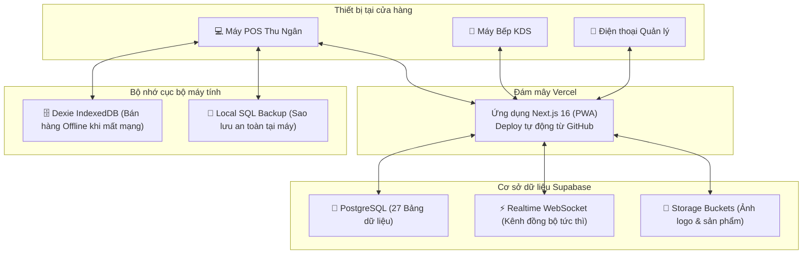

# 📘 HƯỚNG DẪN TỔNG HỢP: KHỞI TẠO DATABASE SQL & TRIỂN KHAI VERCEL
## Hệ Thống: Tiệm Bánh Bakery ERP (POS · Bếp KDS · Quản Trị & Kế Toán)

Tài liệu này là cẩm nang hướng dẫn đầy đủ từ A - Z giúp bạn tự tay thiết lập toàn bộ hệ thống từ con số 0:
- **Phần 1:** Khởi tạo cơ sở dữ liệu Cloud SQL (Supabase) chuẩn bảo mật mới (áp dụng từ 30/10).
- **Phần 2:** Cấu hình môi trường và triển khai ứng dụng lên đám mây Vercel (chạy 24/7).
- **Phần 3:** Danh sách tài khoản đăng nhập và quy trình nghiệm thu ban đầu.
- **Phần 4:** Hướng dẫn vận hành, sao lưu dự phòng và xử lý sự cố.

---

## TỔNG QUAN KIẾN TRÚC HỆ THỐNG



---

## PHẦN 1: KHỞI TẠO CƠ SỞ DỮ LIỆU SQL TRÊN SUPABASE

> [!NOTE]
> Bước này thực hiện khi bạn **tạo mới một chi nhánh**, **chuyển sang tài khoản Supabase mới**, hoặc **muốn làm mới hoàn toàn dữ liệu**.

### Bước 1.1: Tạo Project mới trên Supabase
1. Truy cập trang chủ [https://supabase.com](https://supabase.com) và đăng nhập (bằng tài khoản GitHub hoặc Google/Email).
2. Tại màn hình Dashboard chính, bấm nút **"New Project"**.
3. Điền các trường thông tin:
   - **Name:** Đặt tên dự án (ví dụ: `Bakery-ERP-Production` hoặc `Tiem-Banh-Chi-Nhanh-1`).
   - **Database Password:** Đặt mật khẩu quản trị cơ sở dữ liệu mạnh và lưu lại vào ghi chú an toàn (ví dụ: `TiemBanh@2026!Secret`).
   - **Region (Khu vực máy chủ):** Chọn **Singapore (ap-southeast-1)**. *(Rất quan trọng: Giúp đường truyền POS và Bếp tại Việt Nam đạt độ trễ thấp nhất < 50ms)*.
   - **Pricing Plan:** Chọn gói **Free** (Miễn phí) hoặc Pro tùy nhu cầu.
4. Bấm **"Create new project"** và chờ hệ thống khởi tạo trong khoảng 1 - 2 phút.

---

### Bước 1.2: Chạy File SQL Master (Khởi tạo toàn bộ cấu trúc)
1. Trong menu bên trái của Supabase Dashboard, bấm vào biểu tượng **SQL Editor** (icon `>_`).
2. Bấm vào nút **"+ New query"** để mở một tab soạn thảo SQL mới.
3. Mở file mã nguồn trong máy tính của bạn:
   👉 **Đường dẫn file:** `supabase/schema_full_init.sql`
4. Mở file bằng VS Code hoặc Notepad, nhấn `Ctrl + A` để chọn tất cả -> `Ctrl + C` để copy toàn bộ nội dung.
5. Quay lại Supabase SQL Editor, dán toàn bộ code vào ô soạn thảo.
6. Bấm nút **"Run"** (nút xanh lá ở góc dưới bên phải hoặc phím tắt `Ctrl + Enter`).
7. Khi thấy dòng chữ thông báo màu xanh **"Success. No rows returned"** hiện lên là toàn bộ 27 bảng dữ liệu, trigger, views và các quyền truy cập đã được tạo xong!

```
File schema_full_init.sql sẽ tự động khởi tạo:
├── 27 Bảng dữ liệu (orders, items, products, ingredients, recipes, user_accounts,...)
├── Tự động tạo Storage Buckets: store-logos, products, invoices, avatars
├── Cấu hình Realtime Broadcast cho POS và Bếp
└── Cấp quyền Data API chuẩn bảo mật mới (GRANT ALL + ALTER DEFAULT PRIVILEGES)
```

---

### Bước 1.3: Lấy Thông Tin Kết Nối (URL & API Key)
Sau khi chạy SQL xong, bạn cần lấy 2 thông số kết nối để cài vào Vercel:
1. Ở menu bên trái dưới cùng của Supabase, bấm vào biểu tượng **Settings (⚙️ Project Settings)**.
2. Chọn mục **API** (nằm dưới mục Configuration).
3. Copy 2 thông tin sau lưu tạm vào Notepad:
   - **Project URL:** Có dạng `https://xxxxxxxxxxxxxxxxxxxx.supabase.co`
   - **Project API Keys (`anon` / `public`):** Chuỗi khóa dài bắt đầu bằng `sb_publishable_...` hoặc `eyJ...`

---

## PHẦN 2: CẤU HÌNH MÔI TRƯỜNG & TRIỂN KHAI LÊN VERCEL

### Bước 2.1: Đồng Bộ Mã Nguồn Lên GitHub
Đảm bảo toàn bộ mã nguồn mới nhất của bạn đã được đẩy lên GitHub:
```bash
# Mở terminal tại thư mục bakery-erp
git status
git add .
git commit -m "feat: complete bakery pos deployment"
git push origin main
```
*(Kho mã nguồn mặc định của dự án: `https://github.com/buiquyvietgl4/bakery-pos.git`)*

---

### Bước 2.2: Import Dự Án Vào Vercel
1. Truy cập [https://vercel.com](https://vercel.com) và đăng nhập bằng tài khoản GitHub chứa repository trên.
2. Tại màn hình Dashboard của Vercel, bấm nút **"Add New..."** (ở góc trên bên phải) -> chọn **"Project"**.
3. Tại danh sách repositories hiện ra, tìm `bakery-pos` (hoặc tên repo của bạn) -> bấm nút **"Import"**.

---

### Bước 2.3: Thiết Lập Biến Môi Trường (Environment Variables)

> [!IMPORTANT]
> Đây là bước bắt buộc để website của bạn biết cách kết nối tới database Supabase vừa tạo ở Phần 1!

Tại màn hình cấu hình trước khi deploy (hoặc vào **Settings** -> **Environment Variables** nếu dự án đã tồn tại trên Vercel):
1. Tìm đến mục **Environment Variables**.
2. Thêm lần lượt các biến sau:

| Tên Biến (Key) | Giá trị (Value) | Mô tả & Chức năng | Bắt Buộc? |
|:---|:---|:---|:---:|
| `NEXT_PUBLIC_SUPABASE_URL` | `https://azgjnahbibrcbjooepef.supabase.co`<br/>*(Thay bằng URL của bạn từ Bước 1.3)* | Đường dẫn kết nối database Supabase | **BẮT BUỘC** |
| `NEXT_PUBLIC_SUPABASE_ANON_KEY` | `sb_publishable_Cup5tD9Wt-_-cBcFKJut5g_Wfp8ULkn`<br/>*(Thay bằng Anon Key từ Bước 1.3)* | Khóa công khai truy cập API Supabase | **BẮT BUỘC** |
| `NEXT_PUBLIC_VAPID_PUBLIC_KEY` | `BBRxBu4Wou9gEIrPivlSVhGHcdjEF-8RF5phrRvIxyp6sfQJNCdYOpxc3Uu9qcgE9tao7zRDH1ZvEWL1zyDKU84` | Khóa public thông báo Web Push | Khuyên dùng |
| `VAPID_PRIVATE_KEY` | `xix0rTLV9hqExYqk0InzRAMbhMrYWh-RIPO0mm3ApCw` | Khóa bí mật máy chủ Web Push | Khuyên dùng |
| `VAPID_SUBJECT` | `mailto:admin@tiembanh.com` | Email định danh push thông báo | Khuyên dùng |
| `ROOT_ADMIN_KEY` | `BAKERY-RESCUE-2026` | Khóa khôi phục bảo mật khẩn cấp | Khuyên dùng |

> [!TIP]
> **Mẹo sao chép nhanh:** Bạn có thể mở file mẫu [`.env.example`](.env.example) có sẵn trong dự án, copy toàn bộ và dán thẳng vào ô nhập biến của Vercel (Vercel tự động phân tách Key và Value).

---

### Bước 2.4: Tiến Hành Triển Khai (Deploy)
1. **Framework Preset:** Vercel tự động nhận diện là **Next.js**.
2. **Build Command:** Để mặc định `next build`.
3. **Install Command:** Để mặc định.
   *(Lưu ý: Dự án đã tích hợp sẵn file `.npmrc` chứa cấu hình `legacy-peer-deps=true` để tự động xử lý các xung đột gói, đảm bảo quá trình build trên Vercel luôn thành công 100%)*.
4. Bấm nút **"Deploy"** màu xanh.
5. Chờ khoảng 1 - 2 phút để Vercel biên dịch ứng dụng. Khi màn hình pháo hoa chúc mừng xuất hiện là bạn đã xuất bản website thành công!

---

## PHẦN 3: DANH SÁCH TÀI KHOẢN MẶC ĐỊNH & NGHIỆM THU

Sau khi deploy xong, bạn bấm vào liên kết Vercel cung cấp (ví dụ: `https://bakery-pos.vercel.app`) để kiểm tra hệ thống:

### 3.1. Danh Sách Tài Khoản Đăng Nhập
Hệ thống được cài đặt sẵn 5 tài khoản phân quyền chi tiết:

| Tên Đăng Nhập | Mật Khẩu | Tên Nhân Viên | Vai Trò (Role) | Phạm Vi Quyền Hạn |
|:---|:---|:---|:---|:---|
| `@admin` | `admin123` | Chủ Tiệm (Admin) | Quản trị viên cao nhất | Toàn quyền: POS, Bếp, Quản trị, Kế toán, Phân quyền, Reset |
| `@nhanvien` | `123456` | Thu Ngân Bán Hàng | Nhân viên bán hàng | Bán hàng POS, mở/đóng ca, in bill, đổi trả (cần duyệt) |
| `@bep` | `123456` | Nhân Viên Bếp | Thợ Bếp / KDS | Màn hình Bếp KDS, nhận đơn, xuất mẻ nướng, trừ kho BOM |
| `@mai_thungan`| `password7788` | Mai Thu Ngân | Thu ngân ca sáng | Bán hàng, tạo đơn mang về, kiểm tiền két |
| `@tuan_quanly` | `managerPass123`| Tuấn Quản Lý | Quản lý ca | Duyệt đổi trả, xem báo cáo doanh thu, chốt ca |

---

### 3.2. Quy Trình Nghiệm Thu 5 Bước
1. **Kiểm tra trạng thái kết nối:**
   - Nhìn lên góc phải thanh Header: Nếu có biểu tượng chấm xanh **"Live Sync"** là ứng dụng đã kết nối thành công với Supabase.
2. **Đăng nhập thử tài khoản:**
   - Bấm nút **"Đăng Nhập"** -> Nhập `@admin` / `admin123` -> Kiểm tra tên "Chủ Tiệm (Admin)" hiển thị to rõ trên thanh header máy tính.
3. **Quy trình mở ca và tạo đơn:**
   - Vào mục **Bán hàng (POS)** -> Nhập số tiền mở ca: `1,000,000đ` -> Bấm Mở Ca.
   - Chọn 2 - 3 chiếc bánh vào giỏ hàng -> Chọn thanh toán Tiền mặt hoặc quét mã QR -> Bấm **Hoàn tất đơn hàng**.
4. **Kiểm tra Màn hình Bếp (Kitchen KDS):**
   - Mở thêm 1 tab trình duyệt vào mục **Bếp bánh (KDS)**.
   - Khi tab POS tạo đơn, tab Bếp phải nhận được đơn tức thì kèm âm thanh báo chuông.
5. **Kiểm tra giao diện trên Điện thoại:**
   - Thu nhỏ trình duyệt về kích thước điện thoại (hoặc quét mã mở trên smartphone):
   - Tên tài khoản tự động thu gọn và chạy ngang kiểu banner thông báo.
   - Chuông thông báo và nút đăng xuất nằm gọn hoàn toàn bên trong màn hình.

---

## PHẦN 4: HƯỚNG DẪN VẬN HÀNH, SAO LƯU & XỬ LÝ SỰ CỐ

### 4.1. Cơ Chế Bán Hàng Khi Mất Mạng (Offline Resilience)
- Khi cửa hàng bị đứt cáp quang hoặc rớt Wi-Fi, thanh header sẽ hiển thị badge đỏ **"Offline"**.
- Nhân viên vẫn tiếp tục bấm chọn bánh và thanh toán tiền mặt bình thường. Đơn hàng sẽ được lưu kiên cố vào bộ nhớ trình duyệt (Dexie IndexedDB).
- Khi có mạng Internet trở lại, hệ thống sẽ tự động đối soát (`backupReconciler`) và đẩy toàn bộ các đơn hàng offline lên Cloud SQL Supabase mà không làm mất bất kỳ đơn nào.

### 4.2. Sao Lưu & Phục Hồi Dữ Liệu Dự Phòng
- **Sao lưu tự động:** Hệ thống tự động tạo snapshot sao lưu mỗi khi chốt ca cuối ngày vào bảng `system_cloud_backups`.
- **Sao lưu thủ công:**
  1. Vào menu **Quản trị & Kế toán** -> chọn tab **Sao Lưu & Phục Hồi**.
  2. Bấm **"Xuất Bản Sao Lưu (JSON v2)"** để tải toàn bộ 34 thực thể dữ liệu về máy tính cá nhân.
  3. Để khôi phục: Bấm nút **"Khôi phục từ file"** -> Chọn file JSON đã tải -> Hệ thống sẽ tự phục hồi 100% dữ liệu.

---

### 4.3. Bảng Tra Cứu Lỗi Thường Gặp (Troubleshooting)

| Hiện tượng | Nguyên nhân | Cách khắc phục |
|:---|:---|:---|
| **Vercel báo lỗi `ERESOLVE could not resolve` khi build** | Thiếu cấu hình legacy-peer-deps cho npm | Kiểm tra file `.npmrc` đã có trong dự án với dòng `legacy-peer-deps=true`, commit và push lại lên GitHub |
| **Thanh Header hiển thị chữ "Offline" màu đỏ liên tục** | Sai URL hoặc Anon Key trong biến môi trường Vercel | Vào Vercel Settings -> Environment Variables, kiểm tra lại chính xác `NEXT_PUBLIC_SUPABASE_URL` và `NEXT_PUBLIC_SUPABASE_ANON_KEY` |
| **Bấm vào menu Quản trị báo "Khóa"** | Tài khoản đang đăng nhập không có quyền Admin | Đăng nhập bằng tài khoản `@admin` (mật khẩu: `admin123`) hoặc bấm nút "Mở Admin" trên Header |
| **Mất mật khẩu tài khoản Admin** | Quên mật khẩu đăng nhập | Dùng mã khôi phục tối cao `BAKERY-RESCUE-2026` để mở khóa và đặt lại mật khẩu mới |
| **Supabase báo lỗi `permission denied for table ...`** | Chưa chạy cấp quyền bảo mật Data API | Mở Supabase SQL Editor -> chạy nội dung file `supabase/migrations/00020_post_oct30_data_api_grants.sql` |

---
*Tài liệu được phát hành và chuẩn hóa dành riêng cho hệ thống Bakery ERP. Cập nhật mới nhất: 29/09/2026.*
